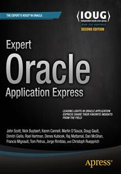

#Apress Source Code

This repository accompanies [*Expert Oracle Application Express*](http://www.apress.com/9781484204856) by Doug Gault, Dimitri Gielis, Martin DSouza, Roel Hartman, Raj Mattamal, Sharon Kennedy, Denes Kubicek, Michael Hichwa, Dan McGhan, John Scott, Anton Nielsen, Francis Mignault, Jorge Rimblas, Nick Buytaert, Karen Cannell, David Peake, Christoph Ruepprich, and Tom Petrus (Apress, 2015).

Download the files as a zip using the green button, or clone the repository to your machine using Git.

##Releases

Release v1.0 corresponds to the code in the published book, without corrections or updates.

##Contributions

See the file Contributing.md for more information on how you can contribute to this repository.
